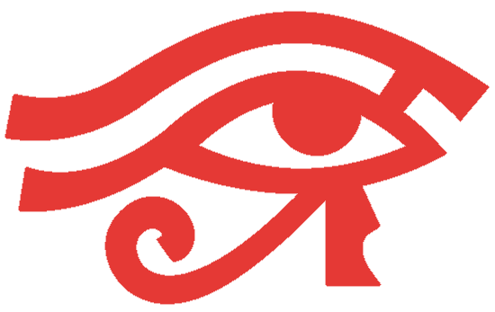

<p align="center">
  
  <br/>
  
  <br/>
  <b><i><big><big>Investigate. Exploit. Remediate.</big></big></i></b>
</p>

<p align="center" style="font-size: 120%;">
  An autonomous AI-powered penetration testing framework that chains reconnaissance, exploitation, and post-exploitation into a single pipeline — then triages every finding, implements code fixes, and opens pull requests. From first packet to merged patch, with human oversight at every critical step.
</p>

<br/>

<p align="center">
  
  
  
  
  
  
  
  
</p>

> **LEGAL DISCLAIMER**: This tool is intended for **authorized security testing**, **educational purposes**, and **research only**. Unauthorized access is **illegal**. By using this tool, you accept **full responsibility** for your actions.

---

## ✨ Key Features

| Feature | Description |
|---------|-------------|
| **End-to-End Pipeline** | Reconnaissance → Exploitation → Post-Exploitation → AI Triage → CodeFix → GitHub PR |
| **Multi-API Key Support** | Configure multiple API keys per provider with automatic round-robin rotation to avoid rate limits |
| **Multi-Model Selection** | Use multiple LLM models simultaneously — switch between OpenAI, Anthropic, Bedrock, Ollama, and any OpenAI-compatible endpoint |
| **70+ Security Tools** | Nmap, Nuclei, Metasploit, Hydra, SQLMap, FFuf, Katana, and more — all running inside Docker |
| **AI Agent Orchestrator** | LangGraph-based autonomous agent with ReAct reasoning across Informational, Exploitation, and Post-Exploitation phases |
| **Knowledge Graph** | Neo4j-powered attack surface graph with 17 node types and 20+ relationship types |
| **CypherFix** | Automated vulnerability remediation — AI triage + CodeFix agent that opens GitHub PRs |
| **Fireteam Mode** | Parallel multi-agent execution for concurrent security testing |
| **Knowledge Base (RAG)** | Local RAG pipeline with curated security datasets (GTFOBins, LOLBAS, OWASP, NVD, ExploitDB) |
| **266+ Project Settings** | Fine-grained control over every tool and workflow |

---

## 🏗️ Architecture

```
┌─────────────────────────────────────────────────────────┐
│                    Anveshak Framework                    │
├──────────────┬──────────────┬──────────────┬────────────┤
│   Webapp     │   AI Agent   │  Recon       │  Kali      │
│  (Next.js)   │  (LangGraph) │  Orchestrator│  Sandbox   │
├──────────────┴──────────────┴──────────────┴────────────┤
│                     Neo4j Knowledge Graph                │
├──────────────┬──────────────┬──────────────┬────────────┤
│  PostgreSQL  │  MCP Servers │  GVM/OpenVAS │  Docker    │
│  (metadata)  │  (5 built-in)│  (optional)  │  Compose   │
└──────────────┴──────────────┴──────────────┴────────────┘
```

### Core Components

- **Webapp** — Next.js dashboard for project management, real-time agent interaction, graph visualization, and settings configuration
- **AI Agent** — Autonomous LangGraph agent with 14 security tools via MCP, phase-gated execution, and configurable autonomy levels
- **Recon Orchestrator** — Parallelized fan-out/fan-in scanning pipeline with 40+ tools chaining subdomain discovery through vulnerability detection
- **Kali Sandbox** — Isolated Kali Linux container providing 70+ CLI security tools for exploitation and post-exploitation
- **Neo4j Graph** — Attack surface knowledge graph storing all findings with relationships for intelligent querying
- **CypherFix** — AI triage + CodeFix pipeline that correlates findings and opens remediation PRs

---

## 🚀 Quick Start

### Prerequisites

- [Docker](https://docs.docker.com/get-docker/) & Docker Compose v2+
- **macOS:** Docker Desktop with ≥4 GB memory (8 GB for GVM)
- **Windows:** Docker Desktop with WSL2 backend

No Node.js, Python, or security tools needed on your host.

### System Requirements

| Resource | Without OpenVAS | With OpenVAS |
|----------|----------------|--------------|
| **CPU**  | 2 cores        | 4 cores      |
| **RAM**  | 4 GB           | 8 GB (16 GB recommended) |
| **Disk** | 20 GB free     | 50 GB free   |

### Installation

```bash
git clone https://github.com/kalkI-pratap17012002/Anveshak.git
cd Anveshak

# Lightweight install (no GVM, no Knowledge Base):
./anveshak.sh install

# With GVM/OpenVAS (full vulnerability scanning):
./anveshak.sh install --gvm

# With local Knowledge Base (RAG-enhanced search):
./anveshak.sh install --kbase

# Everything:
./anveshak.sh install --gvm --kbase
```

### First-Time Setup

1. **Create admin account** — prompted automatically after install
2. **Configure providers** — open `http://localhost:3000/settings`:
   - Add LLM API keys (OpenAI, Anthropic, OpenRouter, Bedrock, Ollama, etc.)
   - Add multiple keys per provider for automatic rotation
   - Select multiple models for flexible agent behavior
3. **Create a project** — open `http://localhost:3000`, set your target, and start scanning

---

## 🔑 Multi-Key & Multi-Model Configuration

### Multiple API Keys

Anveshak supports **multiple API keys per provider** with automatic round-robin rotation. This prevents rate limiting and ensures uninterrupted scanning:

```
Settings → API Keys → Enter one key per line in the textarea
```

Each key is cycled automatically during operations. If one key hits a rate limit, the next key takes over seamlessly.

### Multiple LLM Models

Configure **multiple model identifiers** to give the agent access to different models for different tasks:

```
Settings → LLM Providers → Enter one model per line in the Model Identifier field
```

Supported providers include OpenAI, Anthropic, AWS Bedrock, OpenRouter, Groq, Ollama, vLLM, LM Studio, and any OpenAI-compatible endpoint.

---

## 🔍 Reconnaissance Pipeline

The fully automated recon pipeline maps your target's complete attack surface:

| Phase | Tools | Execution |
|-------|-------|-----------|
| **Subdomain Discovery** | crt.sh, HackerTarget, Subfinder, Amass, Knockpy | 5 tools in parallel |
| **Port Scanning** | Masscan, Naabu | Parallel |
| **Service Detection** | Nmap (-sV, NSE scripts) | Per target |
| **HTTP Probing** | httpx, Wappalyzer | Internal parallel |
| **Web Crawling** | Katana, Hakrawler, GAU, ParamSpider | Parallel |
| **JS Analysis** | jsluice | Post-crawl |
| **Directory Fuzzing** | FFuf | Post-jsluice |
| **Vulnerability Scanning** | Nuclei (9,000+ templates) | Parallel |
| **GraphQL Security** | Introspection, graphql-cop | Parallel |
| **Subdomain Takeover** | Subjack, BadDNS, Nuclei takeover templates | Parallel |
| **Security Checks** | WAF bypass, TLS expiry, missing headers | Parallel workers |
| **CVE Enrichment** | NVD API, Vulners API | Sequential |

---

## 🤖 AI Agent Tool Arsenal

The agent has access to **14+ security tools** via MCP servers inside a Kali sandbox:

| Category | Tools |
|----------|-------|
| **Intelligence** | Graph queries, web search (Tavily), CVE intel, Shodan OSINT, Google dorking |
| **Scanning** | Naabu, Nmap, Nuclei, httpx, WPScan |
| **Web & HTTP** | curl, Katana, jsluice, Arjun, FFuf, Playwright |
| **Exploitation** | Metasploit console, Hydra brute force |
| **Code Execution** | Full Kali shell (70+ tools), code runner (Python, Bash, Ruby, C/C++) |
| **Workspace** | 20+ filesystem tools for code analysis, reporting, and artifact management |

---

## 📋 Management Commands

| Command | Description |
|---------|-------------|
| `./anveshak.sh install` | Build and start (lightweight) |
| `./anveshak.sh install --gvm` | Build with GVM/OpenVAS |
| `./anveshak.sh install --kbase` | Build with Knowledge Base |
| `./anveshak.sh update` | Pull latest, smart-rebuild changed services |
| `./anveshak.sh up` | Start services |
| `./anveshak.sh up dev` | Start in dev mode (hot-reload) |
| `./anveshak.sh down` | Stop services (preserves data) |
| `./anveshak.sh status` | Show running services and version |
| `./anveshak.sh clean` | Remove containers + images, keep data |
| `./anveshak.sh purge` | Remove everything including all data |
| `./anveshak.sh reset-password` | Reset a user's password |
| `./anveshak.sh kb build` | Build Knowledge Base |
| `./anveshak.sh kb update` | Incremental KB refresh |
| `./anveshak.sh kb stats` | Show KB statistics |

---

## 🧠 Knowledge Base (RAG)

Optional local RAG pipeline that searches curated security datasets before falling back to web search:

- **GTFOBins** — Unix binary exploitation techniques
- **LOLBAS** — Windows living-off-the-land binaries
- **OWASP WSTG** — Web security testing guide
- **NVD CVEs** — National Vulnerability Database
- **ExploitDB** — Public exploit archive
- **Nuclei Templates** — Detection rule documentation

```bash
./anveshak.sh install --kbase          # Enable during install
./anveshak.sh kb build lite            # Build lite profile
./anveshak.sh kb update                # Refresh all sources
./anveshak.sh kb stats                 # View statistics
```

---

## 🛠️ Tech Stack

| Layer | Technology |
|-------|------------|
| **Frontend** | Next.js, React, TypeScript, Prisma |
| **AI Agent** | Python, LangGraph, LangChain |
| **Database** | PostgreSQL (metadata), Neo4j (knowledge graph) |
| **Security Tools** | Kali Linux, Metasploit, Nmap, Nuclei, Hydra, 70+ more |
| **Infrastructure** | Docker Compose, MCP (Model Context Protocol) |
| **LLM Providers** | OpenAI, Anthropic, AWS Bedrock, OpenRouter, Ollama, vLLM, and more |
| **Vulnerability Scanner** | GVM/OpenVAS (170,000+ NVTs) |

---

## 📄 License

This project is licensed under the **MIT License** — see [LICENSE](LICENSE) for details.

---

<p align="center">
  <b>Built by <a href="https://github.com/kalkI-pratap17012002">Ayush Kumar</a></b>
  <br/>
  <sub>⭐ Star this repo if you find it useful!</sub>
</p>
